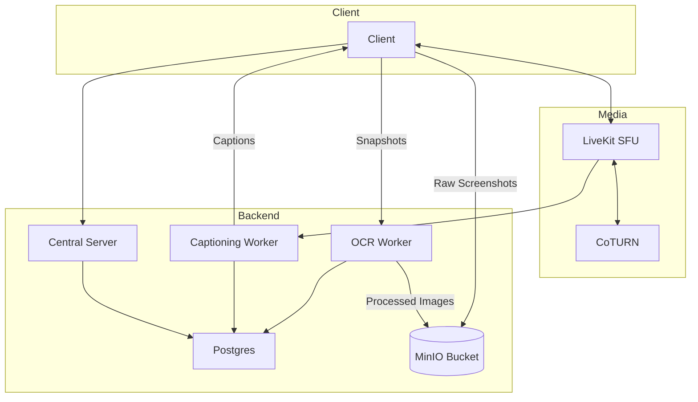

```mermaid
flowchart TD
  subgraph Client
    A[Client]
  end

  subgraph Media
    B1[LiveKit SFU]
    B2[CoTURN]
  end

  subgraph Backend
    C1[Central Server]
    C2[Captioning Worker]
    C3[OCR Worker]
    C4[Postgres]
    C5[(MinIO Bucket)]
  end

  A <--> B1
  B1 <--> B2
  B1 --> C2
  C2 -->|Captions| A
  A -->|Snapshots| C3
  A -->|Raw Screenshots| C5
  C3 --> C4
  C3 -->|Processed Images| C5
  C2 --> C4
  C1 --> C4
  A --> C1
```
