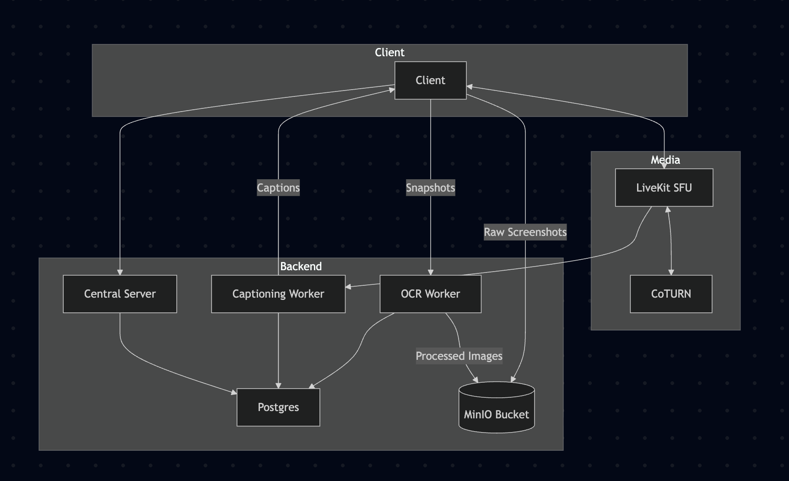

# Architecture

## Overview

This project is a meeting application built with Tauri (React desktop app) and a HonoJS backend.
It enables real-time video meetings with transcription, OCR on screen snapshots, and persistent storage of meeting outcomes.

## Components

### 1. Client (Tauri + React)

Provides the desktop user interface for meetings, captions, and annotations.

Handles media capture (audio/video/screen) and sends snapshots when triggered.

### 2. Media Layer

**LiveKit SFU**: Relays audio and video streams between participants without mixing, ensuring scalability.

**CoTURN (STUN/TURN)**: Provides NAT traversal and fallback relaying to ensure connectivity across networks.

### 3. Backend (HonoJS)

Central API server for managing meeting lifecycle, authentication, and data persistence.

Integrates with workers for transcription and OCR, and communicates with the database.

### 4. Processing Workers

**Captioning Worker**: Consumes audio streams from LiveKit, generates live captions, and stores transcripts.

**OCR Worker**: Processes snapshots of screen shares to extract text, supporting searchable meeting records.

### 5. Storage (Postgres)

Stores meeting metadata, transcripts, OCR outputs, captions, and summaries.

Provides queryable history for review and analytics.
